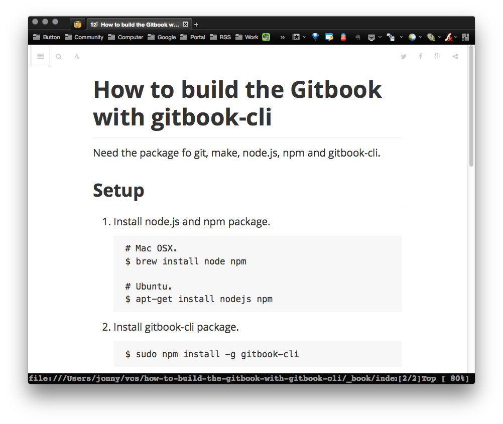

# How to build the Gitbook with gitbook-cli

Need the package fo git, make, node.js, npm and gitbook-cli.

## Setup

1. Install node.js and npm package.

        # Mac OSX.
        $ brew install node npm

        # Ubuntu.
        $ sudo apt-get install nodejs npm

1. Install [n](https://github.com/tj/n) with npm.

        $ sudo npm install n -g
        
1. Downgrade node.js to v5.12.0. (see [Build error with node v6 · Issue #1](https://github.com/chusiang/how-to-build-the-gitbook-with-gitbook-cli/issues/1)) 

        $ n 5.12.0        

1. Install gitbook-cli package.

        $ sudo npm install -g gitbook-cli

1. Install necessary package with npm.

        $ gitbook install

1. Check version.

        $ gitbook -V
        CLI version: 2.3.0
        GitBook version: 3.1.1

1. Install **[calibre](http://calibre-ebook.com/about)** for build pdf, epub and mobi.

1. Link **calibre command line tool**.

        # Mac OSX.
        $ ln -s /Applications/calibre.app/Contents/MacOS/ebook-convert /usr/local/bin/

## Get repository.

Get *MyBook* with git.

    $ git clone https://github.com/chusiang/how-to-build-the-gitbook-with-gitbook-cli.git

## Build

1. Go to `MyBook` project.

        $ cd ${MyBook}

1. Build static HTML.

        $ make

1. Build PDF.

        $ make pdf

1. Build epub for iDevice.

        $ make epub

1. Build mobi for Kindle.

        $ make mobi

1. Review result at local.

        $ make review

1. Clean.

        $ make clean

## Reference

- [GitBook 中文解說 - 2.0 搶先預覽 - GitBook](https://www.gitbook.com/book/wastemobile/gitbook-chinese/details)
- [GitbookIO/gitbook-cli | GitHub](https://github.com/GitbookIO/gitbook-cli)
- [深入淺出 GitBook 寫作與自助出版，電子書也能多人協作 by lyhcode | CodeData](http://www.codedata.com.tw/social-coding/gitbook-self-publishing/)
- [gitbook | npm](https://www.npmjs.com/package/gitbook)
- [Convert to PDF - Need to install ebook-convert from Calibre · Issue #333 · GitbookIO/gitbook](https://github.com/GitbookIO/gitbook/issues/333)

### CI

* Ansible Role: [chusiang.gitbook](https://galaxy.ansible.com/chusiang/gitbook/)
* Docker Hub: [chusiang/gitbook](https://hub.docker.com/r/chusiang/gitbook/)
* GitHub: [chusiang/gitbook.ansible.role](https://github.com/chusiang/gitbook.ansible.role)
* Travis CI: [chusiang/gitbook.ansible.role](https://travis-ci.org/chusiang/gitbook.ansible.role)

